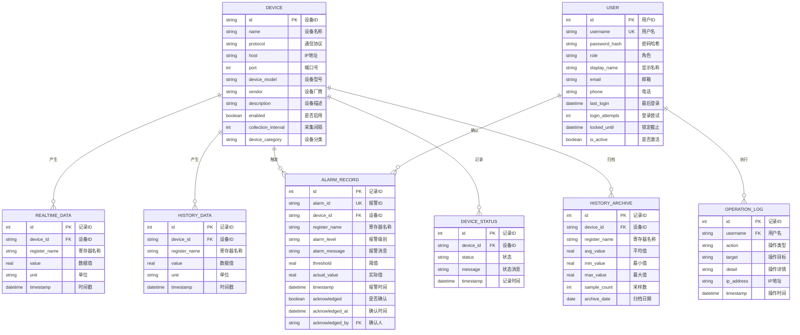

# 工业SCADA系统E-R图设计

## 一、实体识别

基于数据库分析，系统包含以下核心实体：

### 1. 设备实体（Device）
**说明**：工业设备，是系统的核心实体，所有数据采集、监控、报警都围绕设备展开。
**存储方式**：配置文件（`配置/devices.yaml`）+ 运行时内存

| 属性 | 类型 | 说明 | 备注 |
|------|------|------|------|
| id | String | 设备唯一标识 | 主键，如 `siemens_1500_01` |
| name | String | 设备名称 | 如"西门子S7-1500 PLC" |
| protocol | String | 通信协议 | `modbus_tcp`, `opcua`, `mqtt`, `rest` |
| host | String | 设备IP地址 | 如 `192.168.1.53` |
| port | Integer | 端口号 | 如 `502` |
| device_model | String | 设备型号 | 如 `S7-1516-3 PN/DP` |
| vendor | String | 设备厂商 | 如"西门子" |
| description | String | 设备描述 | 备用信息 |
| enabled | Boolean | 是否启用 | `true`/`false` |
| collection_interval | Integer | 采集间隔（秒） | 如 `5` |
| device_category | String | 设备分类 | `mechanical`(机械), `instrument`(仪表), `safety`(安全) |

### 2. 用户实体（User）
**说明**：系统用户，负责操作和监控。
**存储位置**：`users` 表

| 属性 | 类型 | 说明 | 约束 |
|------|------|------|------|
| id | INTEGER | 用户ID | 主键，自增 |
| username | String | 用户名 | UNIQUE, NOT NULL |
| password_hash | String | 密码哈希 | NOT NULL, bcrypt加密 |
| role | String | 角色 | `admin`, `operator`, `viewer` |
| display_name | String | 显示名称 | |
| email | String | 邮箱 | |
| phone | String | 电话 | |
| last_login | DATETIME | 最后登录时间 | |
| login_attempts | INTEGER | 登录尝试次数 | 默认0 |
| locked_until | DATETIME | 锁定截止时间 | |
| created_at | DATETIME | 创建时间 | 默认当前时间 |
| updated_at | DATETIME | 更新时间 | 默认当前时间 |
| is_active | Boolean | 是否激活 | 默认1 |

### 3. 实时数据实体（RealtimeData）
**说明**：设备寄存器的最新值，每个设备+寄存器仅保留一条记录。
**存储位置**：`realtime_data` 表

| 属性 | 类型 | 说明 | 约束 |
|------|------|------|------|
| id | INTEGER | 记录ID | 主键，自增 |
| device_id | String | 设备ID | NOT NULL |
| register_name | String | 寄存器名称 | NOT NULL |
| value | REAL | 数据值 | |
| unit | String | 单位 | 如 `°C`, `MPa` |
| timestamp | DATETIME | 时间戳 | NOT NULL |
| created_at | DATETIME | 创建时间 | 默认当前时间 |

**约束**：`UNIQUE(device_id, register_name)`

### 4. 历史数据实体（HistoryData）
**说明**：设备寄存器的历史值，保留全量记录。
**存储位置**：`history_data` 表

| 属性 | 类型 | 说明 | 约束 |
|------|------|------|------|
| id | INTEGER | 记录ID | 主键，自增 |
| device_id | String | 设备ID | NOT NULL |
| register_name | String | 寄存器名称 | NOT NULL |
| value | REAL | 数据值 | |
| unit | String | 单位 | |
| timestamp | DATETIME | 时间戳 | NOT NULL |
| created_at | DATETIME | 创建时间 | 默认当前时间 |

### 5. 报警记录实体（AlarmRecord）
**说明**：设备报警信息，包含报警级别、阈值、实际值等。
**存储位置**：`alarm_records` 表

| 属性 | 类型 | 说明 | 约束 |
|------|------|------|------|
| id | INTEGER | 记录ID | 主键，自增 |
| alarm_id | String | 报警唯一标识 | NOT NULL |
| device_id | String | 设备ID | NOT NULL |
| register_name | String | 寄存器名称 | NOT NULL |
| alarm_level | String | 报警级别 | `critical`, `warning`, `info` |
| alarm_message | String | 报警消息 | |
| threshold | REAL | 阈值 | |
| actual_value | REAL | 实际值 | |
| timestamp | DATETIME | 报警时间 | NOT NULL |
| acknowledged | Boolean | 是否已确认 | 默认0 |
| acknowledged_at | DATETIME | 确认时间 | |
| acknowledged_by | String | 确认人 | 关联User.username |
| created_at | DATETIME | 创建时间 | 默认当前时间 |

### 6. 设备状态实体（DeviceStatus）
**说明**：设备状态变化记录。
**存储位置**：`device_status` 表

| 属性 | 类型 | 说明 | 约束 |
|------|------|------|------|
| id | INTEGER | 记录ID | 主键，自增 |
| device_id | String | 设备ID | NOT NULL |
| status | String | 状态 | `online`, `offline`, `error`, `stopped` |
| message | String | 状态消息 | |
| timestamp | DATETIME | 记录时间 | NOT NULL |
| created_at | DATETIME | 创建时间 | 默认当前时间 |

### 7. 历史归档实体（HistoryArchive）
**说明**：历史数据的聚合归档，用于长期存储。
**存储位置**：`history_archive` 表

| 属性 | 类型 | 说明 | 约束 |
|------|------|------|------|
| id | INTEGER | 记录ID | 主键，自增 |
| device_id | String | 设备ID | NOT NULL |
| register_name | String | 寄存器名称 | NOT NULL |
| avg_value | REAL | 平均值 | |
| min_value | REAL | 最小值 | |
| max_value | REAL | 最大值 | |
| sample_count | INTEGER | 采样数 | |
| archive_date | DATE | 归档日期 | NOT NULL |
| created_at | DATETIME | 创建时间 | 默认当前时间 |

### 8. 操作日志实体（OperationLog）
**说明**：用户操作记录，用于审计和追踪。
**存储位置**：`operation_logs` 表

| 属性 | 类型 | 说明 | 约束 |
|------|------|------|------|
| id | INTEGER | 记录ID | 主键，自增 |
| username | String | 操作用户名 | NOT NULL |
| action | String | 操作类型 | `add_device`, `delete_device`, `stop_device`, `start_device`, `batch_stop`, `batch_start`, `trigger_estop`, `reset_estop` |
| target | String | 操作目标 | 如设备ID |
| detail | String | 操作详情 | |
| ip_address | String | 操作IP地址 | |
| timestamp | DATETIME | 操作时间 | 默认当前时间 |

## 二、实体关系

### 1. 设备与数据的关系（1:N）
- **设备** (1) → (N) **实时数据**：一个设备有多个寄存器的实时数据
- **设备** (1) → (N) **历史数据**：一个设备有多个寄存器的历史数据
- **设备** (1) → (N) **历史归档**：一个设备有多个寄存器的归档数据

**关系属性**：通过 `device_id` 关联

### 2. 设备与报警的关系（1:N）
- **设备** (1) → (N) **报警记录**：一个设备可以产生多条报警

**关系属性**：通过 `device_id` 关联

### 3. 设备与状态的关系（1:N）
- **设备** (1) → (N) **设备状态**：一个设备有多条状态变化记录

**关系属性**：通过 `device_id` 关联

### 4. 用户与操作日志的关系（1:N）
- **用户** (1) → (N) **操作日志**：一个用户可以执行多次操作

**关系属性**：通过 `username` 关联

### 5. 用户与报警确认的关系（1:N）
- **用户** (1) → (N) **报警记录**：一个用户可以确认多条报警

**关系属性**：通过 `acknowledged_by` 关联

## 三、E-R图（Mermaid语法）



## 四、关系说明

### 4.1 设备-数据关系
- **类型**：一对多（1:N）
- **基数**：一个设备可以有多个寄存器，每个寄存器产生实时数据、历史数据和归档数据
- **依赖性**：数据依赖于设备存在，设备删除时，相关数据应保留（历史数据）或清理（实时数据）

### 4.2 设备-报警关系
- **类型**：一对多（1:N）
- **基数**：一个设备可以触发多条报警记录
- **业务规则**：报警基于寄存器值与阈值的比较，支持多级报警（critical/warning/info）

### 4.3 设备-状态关系
- **类型**：一对多（1:N）
- **基数**：一个设备有多条状态变化记录
- **状态类型**：`online`（在线）、`offline`（离线）、`error`（错误）、`stopped`（停止）

### 4.4 用户-操作日志关系
- **类型**：一对多（1:N）
- **基数**：一个用户可以执行多次操作
- **审计要求**：记录所有关键操作，包括设备管理、控制操作等

### 4.5 用户-报警确认关系
- **类型**：一对多（1:N）
- **基数**：一个用户可以确认多条报警
- **业务规则**：报警确认后，`acknowledged`字段设为1，记录确认时间和确认人

## 五、扩展实体（可选）

### 5.1 预设设备（PresetDevice）
**说明**：系统预设的设备模板，用于快速添加设备。
**存储位置**：`配置/simulation_presets.yaml`

| 属性 | 类型 | 说明 |
|------|------|------|
| preset_id | String | 预设ID |
| name | String | 预设名称 |
| device_config | Object | 设备配置模板 |
| sim_params | Object | 模拟参数 |

### 5.2 系统配置（SystemConfig）
**说明**：系统全局配置参数。
**存储位置**：`config.py` + 环境变量

| 属性 | 类型 | 说明 |
|------|------|------|
| config_key | String | 配置键 |
| config_value | String | 配置值 |
| description | String | 配置描述 |

## 六、绘图建议

### 6.1 推荐绘图工具
1. **Mermaid Live Editor**：https://mermaid.live/
   - 直接使用上述Mermaid代码渲染E-R图
   - 支持导出PNG、SVG格式

2. **Draw.io (diagrams.net)**：https://app.diagrams.net/
   - 免费在线绘图工具
   - 支持E-R图模板

3. **Lucidchart**：https://www.lucidchart.com/
   - 专业绘图工具
   - 支持团队协作

4. **PowerDesigner**：数据库建模专业工具
   - 支持正向/逆向工程

### 6.2 绘图步骤
1. **绘制实体矩形**：每个实体一个矩形，分为两部分（实体名+属性）
2. **标注主键**：属性名后加`(PK)`
3. **标注外键**：属性名后加`(FK)`
4. **绘制关系线**：
   - 一对一：`1:1`
   - 一对多：`1:N`
   - 多对多：`M:N`
5. **添加基数标注**：在关系线两端标注基数（1, N, M等）

### 6.3 论文中的E-R图规范
1. **清晰简洁**：避免过多细节，突出核心实体和关系
2. **标注完整**：每个实体、属性、关系都要有说明
3. **符合规范**：遵循数据库设计规范（如第三范式）
4. **颜色区分**：可以用不同颜色区分实体类型（如设备类、数据类、用户类）

## 七、数据库优化索引

系统已创建以下索引以优化查询性能：

```sql
-- 实时数据索引
CREATE INDEX idx_realtime_device_time ON realtime_data(device_id, timestamp);
CREATE INDEX idx_realtime_register ON realtime_data(device_id, register_name, timestamp);

-- 历史数据索引
CREATE INDEX idx_history_device_time ON history_data(device_id, timestamp);
CREATE INDEX idx_history_register ON history_data(device_id, register_name, timestamp);

-- 报警记录索引
CREATE INDEX idx_alarm_device_time ON alarm_records(device_id, timestamp);
CREATE INDEX idx_alarm_level ON alarm_records(alarm_level, acknowledged);
CREATE INDEX idx_alarm_unacked ON alarm_records(acknowledged, timestamp) WHERE acknowledged = 0;

-- 历史归档索引
CREATE INDEX idx_archive_device_date ON history_archive(device_id, archive_date);

-- 用户索引
CREATE INDEX idx_users_username ON users(username);
CREATE INDEX idx_operation_logs_user ON operation_logs(username, timestamp);
```

## 八、总结

本SCADA系统采用关系型数据库（SQLite）存储核心业务数据，包含8个核心实体：
1. **设备**：系统核心，所有数据围绕设备展开
2. **用户**：系统操作者，负责监控和管理
3. **实时数据**：设备当前状态，高频更新
4. **历史数据**：设备历史记录，用于分析和追溯
5. **报警记录**：异常情况记录，支持多级报警
6. **设备状态**：设备生命周期记录
7. **历史归档**：数据聚合存储，优化长期查询
8. **操作日志**：用户操作审计，保障系统安全

实体间关系清晰，满足工业SCADA系统的数据管理需求。